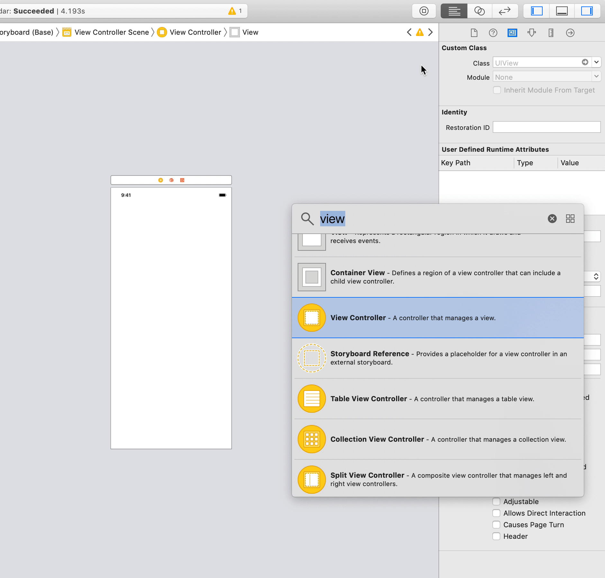
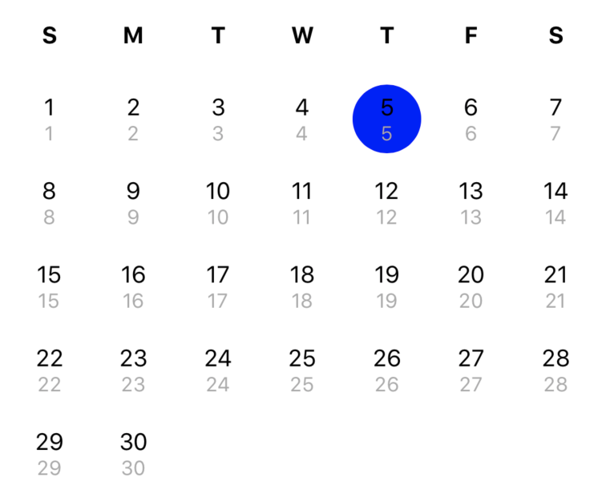
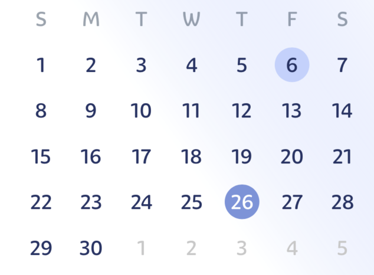
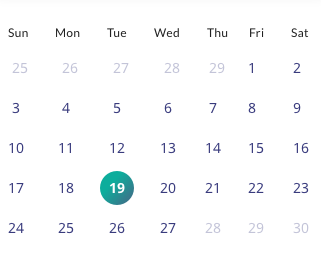

## CalendarView


Lightweight lib for displaying singleView calendar in your app.
Support any calendar supported by native iOS SDK.

<p align="left">
  
  
  </a>
  <a href="https://github.com/icon-project/ICONKit" target="_blank">
    
  </a>
    <a href="https://github.com/icon-project/ICONKit" target="_blank">
    
  </a>
</p>

<p align="center">
  
</p>


## Installation

### Using [CocoaPods](https://cocoapods.org):

Simply add the following line to your Podfile:

```ruby
pod 'HKCalendarView'
```

This will download the CalendarView binaries and dependencies in `Pods/` during your next
`pod install` execution.

This is the recommended way to install a specific version of CalendarView.


## Usage

* add view to your interface and specify class name `CalendarView`


<p align="center">
  
</p>

Or alternatively just create view in code and add it to your interface

``` swift
let calendarView = CalendarView(frame: CGRect(x: 0, y:0. width: 350, height: 350)
let insets = UIEdgeInsets.zero // or any you like
calendarView.translatesAutoresizingMaskIntoConstraints = false

let views = [
	"subview": calendarView
]
let metrics = [
	"left": insets.left,
	"right": insets.right,
	"top": insets.top,
	"bottom": insets.bottom
]

superview.addSubview(calendarView)
var constraints = NSLayoutConstraint.constraints(withVisualFormat: "H:|-left-[subview]-right-|",
                                                       options: [.alignAllLeading, .alignAllTrailing],
                                                       metrics: metrics,
                                                       views: views)
constraints.append(contentsOf: NSLayoutConstraint.constraints(withVisualFormat: "V:|-top-[subview]-bottom-|",
	                                                    options: [.alignAllTop, .alignAllBottom],
	                                                    metrics: metrics,
	                                                    views: views))
NSLayoutConstraint.activate(constraints)

```

* grab IBOutlet from View

`@IBOutlet private weak var calendarView: CalendarView!`

That's it - you done!

### Advanced configuration

User different delegates for preparing own version of UI

Example - own UI

``` swift
extension ViewController: CalendarViewItemProviderDelegate {

  func calendarView(didRequestBuildComponentsForRegistration calendarView: CalendarView) -> [CalendarItemPresentable.Type] {
    /*you can provide array of items*/
    return [MyDateItem.self]
  }

  func calendarView(_ calendarView: CalendarView, didRequestDateItemFor date: Date, calendar: Calendar, locale: Locale) -> CalendarDateItemPresentable {
    /*create any item from provided array types in func above*/
    let item = MyDateItem(date: date, calendar: calendar, locale: locale)
    return item
  }

  func calendarView(_ calendarView: CalendarView,
                    didRequestWeekDayItemFor style: CalendarWeekSymbolType,
                    forWeekNameItem item: CalendarWeekDayViewPosition,
                    poposedName name: String,
                    calendar: Calendar,
                    locale: Locale) -> CalendarWeekDayItemPresentable {
    /*create any item from provided array types in func above*/
    /*check poposedName and style and modify if u want*/
    let item = MyDateItem(weekDayName: name, calendar: calendar, locale: locale)
    return item
  }

  func calendarView(_ calendarView: CalendarView, didCompleteConfigure cell: CalendarItemConfigurable, for buildItem: CalendarItemPresentable) {
    /*modify cell additionally as u wish here*/
  }
}
```

For details of configuration - please see example and documentation for each class

#### Result:

<p align="center">
  
</p>

Also u can use different options for changing behaviour of app.

``` swift
  /// This option allow some debug prints, usefull for checking behaviour of different calendar
  /// as result u will see date in selected calendar and in gregorian calendar in same line
  public static let debugMode = CalendarAppearenceOption(rawValue: 1 << 0)

  /// Enable enclosing (prev and next) month to be displayed
  public static let showEnclosingMonth = CalendarAppearenceOption(rawValue: 1 << 1)

  /// If enabled **showEnclosingMonth** option, this option will allow date selection for non selected month
  public static let enableEnclosingMonthSelection = CalendarAppearenceOption(rawValue: 1 << 2)

  /// If enabled **showEnclosingMonth** option, day's that are in current month will be hightlighted
  public static let hightlightCurrentMonth = CalendarAppearenceOption(rawValue: 1 << 3)

  /// If selected `CalendarSelectionType.single`, this option may enable deselect already selected item
  public static let allowSingleDeselectionForSingleMode = CalendarAppearenceOption(rawValue: 1 << 4)

  /// Represent set of minimal (non) option for calendar
  public static let noOption: CalendarAppearenceOption = []

  /// Default set of options for calendar - `showEnclosingMonth` and `hightlightCurrentMonth`
  public static let `default`: CalendarAppearenceOption = [.showEnclosingMonth, .hightlightCurrentMonth, .debugMode]

```

#### Samples:

<div class="row">
  <div class="column">
    <p align="center">
      
      
      
    </p>
  </div>
</div>

## TODO

- test
- multiselection of dates
- range date selection
- user-defined animation

## Requirement

- Xcode 10 or higher
- iOS 11 or higher
- Swift 5 or higher
- [Cocoapods](https://cocoapods.org)

## License

[MIT licensed.](LICENSE)

## Contact

Have a question or an issue about `CalendarView`? Create an [issue](https://github.com/kirillgorbushko/CalendarView/issues/new)!

If you would like to contribute - just create a pull request.
